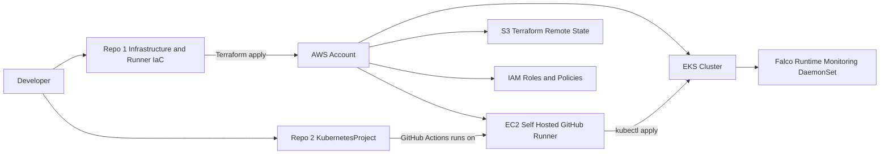
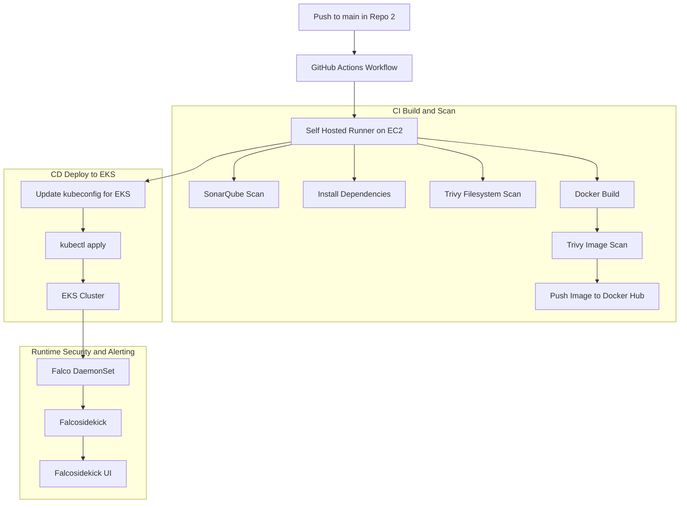

# 🔐 Infrastructure Provisioning & Self-Hosted GitHub Runner

<!-- Technology Badges -->

<!-- Status Badges -->

## Overview

This repository defines the **core infrastructure foundation** for a multi-repository DevSecOps Kubernetes project on **AWS**.

It is responsible for:

- Provisioning a secure **Amazon EKS cluster** using **Terraform (Infrastructure as Code)**
- Deploying a **self-hosted GitHub Actions runner on EC2** to support privileged CI/CD operations
- Configuring AWS **IAM roles and permissions** required for infrastructure automation and cluster access
- Preparing the execution environment for downstream CI/CD pipelines and application deployments
- Enabling integration with **security and runtime tooling** such as Falco, Trivy, and SonarQube

As **Repo 1**, this project establishes the shared infrastructure and execution layer that **[Repo 2](https://github.com/SadaC-hub/KubernetesProject)** builds upon to implement application delivery, security scanning, and automated deployment workflows.

---

## Architecture Diagram

### Architecture & Workflow Summary

- **Repo 1** provisions the shared cloud infrastructure using Terraform, including the Amazon EKS cluster and a self-hosted GitHub Actions runner on EC2.
- **Repo 2** contains the application and CI/CD logic and reuses the same self-hosted runner to execute build, scan, and deployment workflows.
- All CI and CD jobs run on the self-hosted runner, enabling privileged operations and the use of custom security tooling.
- Container images are built and scanned before being pushed to Docker Hub and deployed to EKS.
- Runtime security is enforced inside the cluster using Falco, with alerts forwarded via Falcosidekick and visualised in Falcosidekick UI.

---

## Tech Stack

| Category | Technologies |
|--------|--------------|
| Cloud Platform | AWS (EC2, EKS, IAM, S3) |
| Infrastructure as Code | Terraform |
| CI/CD | GitHub Actions (Self-Hosted Runner) |
| Containerisation | Docker |
| Kubernetes | Amazon EKS, kubectl |
| Security Scanning | Trivy, SonarQube |
| Runtime Security | Falco, Falcosidekick, Falcosidekick UI |
| Version Control | GitHub |

---

## Skills Demonstrated

- **Infrastructure as Code:** Provisioned AWS infrastructure (EKS, EC2, IAM, S3) using Terraform
- **Managed Kubernetes Provisioning:** Created and configured an Amazon EKS cluster for downstream workloads
- **Self-Hosted CI Runners:** Built and operated a self-hosted GitHub Actions runner on EC2
- **Privileged CI Execution:** Enabled secure execution of Terraform and kubectl from CI pipelines
- **Platform Tooling:** Installed and maintained Docker, kubectl, Terraform, and security tooling on the runner
- **Runtime Security Foundations:** Deployed Falco to EKS with alert forwarding via Falcosidekick UI

---

## Why a Self-Hosted Runner?

- Supports **custom tooling** (Falco, Trivy FS, SonarQube scanner).
- Enables full customisation of CI/CD behaviour.
- Suitable for projects that require **privileged operations**, such as:
  - Terraform apply  
  - Building & pushing Docker images  
  - Installing kernel-level tools (Falco)

